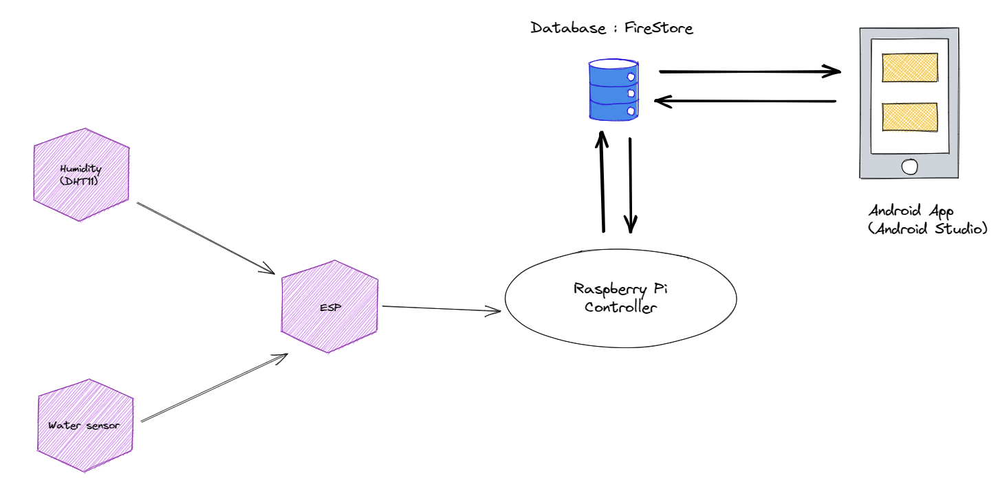

# Filder - Smart Agriculture Management System
Fielder 2.0 is a cutting-edge project that addresses the challenges faced by field managers in overseeing multiple fields simultaneously. The manual and individual management of fields can be cumbersome, time-consuming, and prone to human errors. Fielder 2.0 aims to streamline this process by leveraging IoT technology, mobile development tools, and artificial intelligence to enhance decision-making and optimize agricultural operations.

## Table of Contents
* [General Information](#general-information)
* [Setup](#setup)
* [Screenshots](#screenshots)

## General Information
### Architecture of the project
The project architecture is logically divided into three main layers:
#### 1. Presentation Layer : Android application
- Interface for user interaction, command issuance, and data visualization.
- Controls the state of the solenoid valve for remote irrigation.
#### 2. Data Access Layer : Sensors
- Collects data from field sensors (humidity, temperature, water level) using ESP32.
- Uses MQTT to transmit data reliably and securely to the Raspberry Pi.
#### 3. Control Layer : Raspberry
- Processes collected data before storing it in the database.
- Utilizes Firebase API to send formatted data to Firebase.

This github repository contains the code of the android application

### Technologies Used

### Main Features
#### 1. For Manager:
- View field indicators (temperature, humidity, water level) numerically and graphically.
- Manage (add, modify, consult) static field data.
- View recommendations for each field.
- Manage (add, modify, consult, delete) worker data.
- View and generate alerts.
- Control (turn on, turn off) the solenoid valve.
#### 1. For workers:
- View field indicators (temperature, humidity, water level).
- View static field data.
- Manage their profile.
- View and generate alerts.

## Setup

## Screenshots

  
  
  
  
  
  
  

